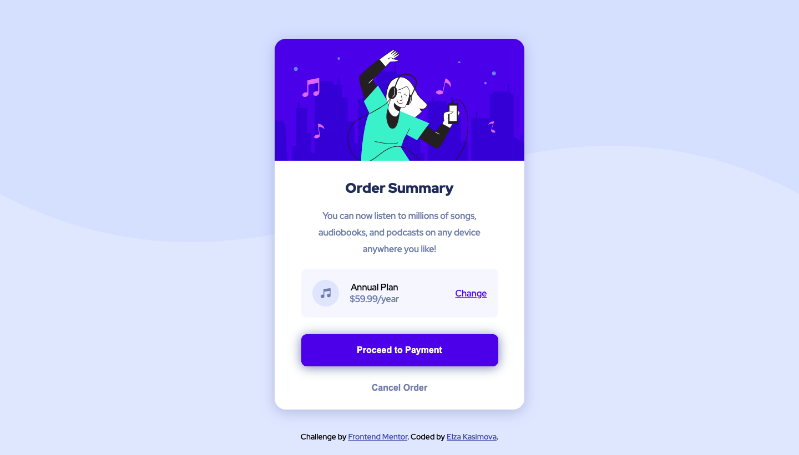

# Frontend Mentor - Order summary card solution

This is a solution to the [Order summary card challenge on Frontend Mentor](https://www.frontendmentor.io/challenges/order-summary-component-QlPmajDUj). Frontend Mentor challenges help you improve your coding skills by building realistic projects.

## Table of contents

- [Overview](#overview)
  - [The challenge](#the-challenge)
  - [Screenshots](#screenshots)
  - [Links](#links)
- [My process](#my-process)
  - [Built with](#built-with)

## Overview

### The challenge

Users should be able to:

- See hover states for interactive elements

### Screenshots

Desktop version

Mobile version

### Links

- Solution URL: [Solution URL here](https://www.frontendmentor.io/solutions/order-summary-card-solution-html-and-css-flexbox-CDeVjgvig)
- Live Site URL: [Live site URL here](https://5elza5.github.io/FM-Order-Summary-Component-Challenge/)

## My process

### Built with

- Semantic HTML5 markup
- CSS custom properties
- Flexbox
